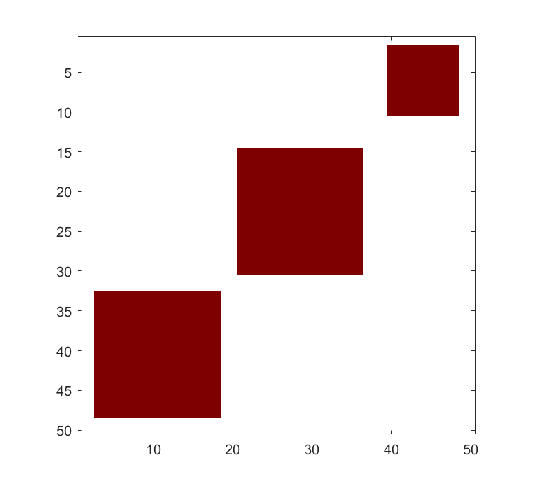
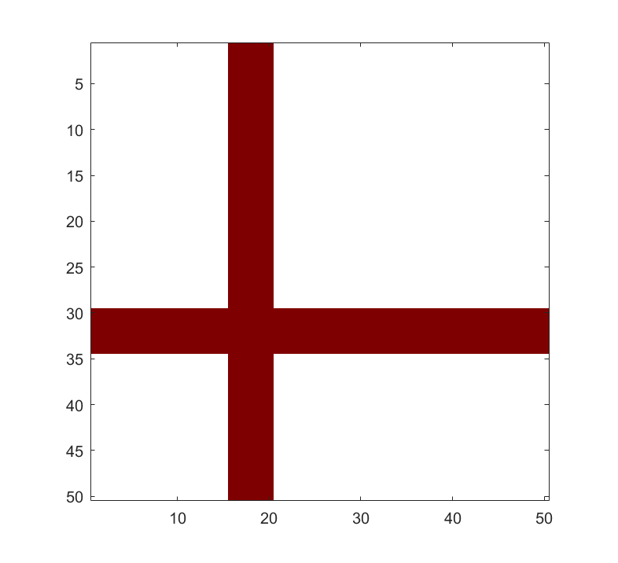
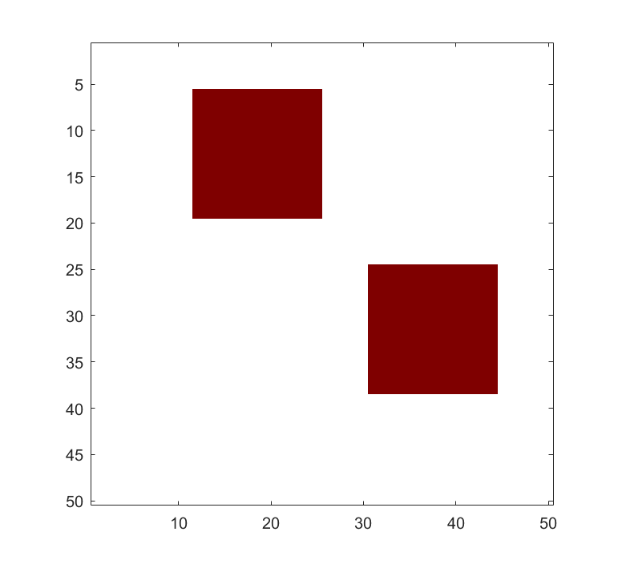
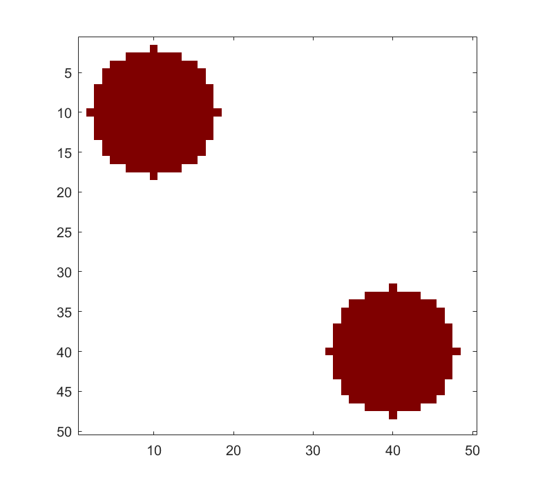
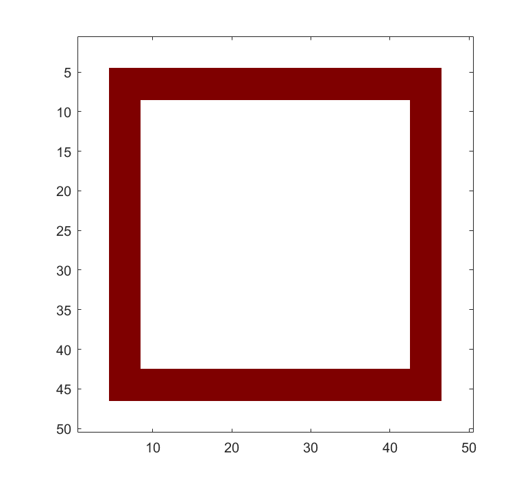
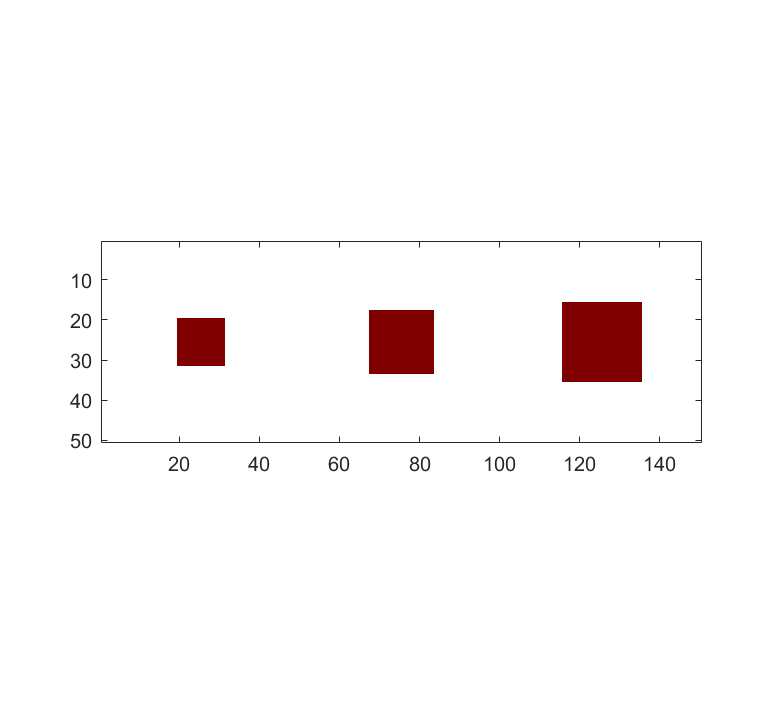
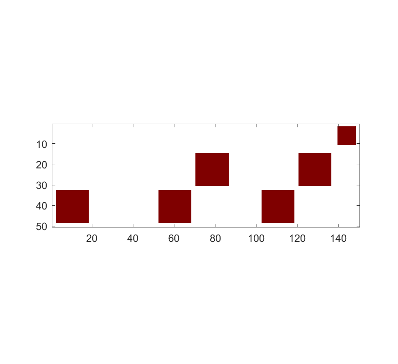

# Partial Quantile Tensor Regression (PQTR)
This repository contains the MATLAB implementation of PQTR and simulation example codes.
Partial Quantile Tensor Regression is an innovative method for quantile regression with tensor predictors based partial-least-sqaure-type (PLS) algorithm.
The functions and scripts require Tensor Toolbox for MATLAB (>=v3.6).

## Installation

1. Download all the function files 
2. Add the whole folder to the path in MATLAB

## Introduction and usage

`pqtr` is the main function of PQTR. Please use `help pqtr` for more detials of usage.
`pqtr` fits the quantile regression model

$$
    Y(\tau)  = \alpha(\tau)+\beta(\tau)^{T}Z+<\mathcal{B}(\tau),\mathcal{X}>
$$

with PLS-type algorithm.
Here, $Y$ is the response, $Z$ is the low-dimensional vector predictor, $\mathcal{X}$ is the tensor predictor and $\tau$ is the quantile of $Y$ to be fitted.
The PLS-type algorithm requires the dimension/rank of reduced tensor predictor.
`pqtr` provides three methods for specifying the dimesion/rank:

* Fix: Users provide a fixed dimension/rank 
    
        [alpha, gamma, B_tau, ~] = pqtr(X, Y, Z, tau, 'd', [1,1],'dselect',"Fix");

* ER: the eigenvalue ration method

        [alpha, gamma, B_tau, u] = pqtr(X, Y, Z, tau, 'dselect',"ER");

* CV: the cross-validation method

        [alpha, gamma, B_tau, u] = pqtr(X, Y, Z, tau, 'dselect',"CV");

When the dimension/rank `d` is not provided, the algorithm-selected dimesnion/rank would be in the output as `u`.

## Code Example

`simulation.m` provides a comprehesive example on how to simulate the data in various cases and fit the model with `pqtr`. Here is a simple example.

        Y = normrnd[0,1,[100,1]];
        Z = normrnd[0,1,[100,1]];
        X = tensor(normrnd[0,1,[100,16,16,16]]);
        [alpha, gamma, B_tau, u] = pqtr(X, Y, Z, tau);

# Specifications of simulation set-ups

The data generation settings of the simulation script `simulation.m` are mainly controlled by the following parameters:
* scenario (`scena`) and source (`src`): specify the the shape of tensor coefficients $\mathcal{B}(\tau)$ across different quantiles $\tau$;
* `casenum`: given `scena` and `src`, sets the quantile regression coefficient settings, i.e., homogeneous or hetergeneous across different quantiles;
* `varcase`: determines the covariance matrix model;
* `errdist`: characterizes the distribution of Y given the predictors;
* `alpha` and `gamma`: specify $\alpha$, the intercept, and $\gamma$, the cofficient of $\mathbf{Z}$.
* `nvec`: a vector of different sample size

To change the simulation settings, please simply set the above variables as indicated at the begining of the `simulation.m`.

Please refer to the following sections for the detailed settings.

## Parameter specification for the shape of tensor coefficients $\mathcal{B}(\tau)$

### scenario (`scena`) = 1 

Scenario 1 contains the low rank shapes for homogeneous coefficient setting.

#### source (`src`) = 1

The tri-square shape for the homogeneous coefficient across different quantiles.

#### source (`src`) = 2
The cross shape for the homogeneous coefficient across different quantiles.

#### source (`src`) = 3
The bi-square shape with  for the homogeneous coefficient across different quantiles.

### scenario (`scena`) = 2 

Scenario 2 contains the higher rank shapes for homogeneous coefficient setting.

#### source (`src`) = 2

The bi-circle shape for the homogeneous coefficient across different quantiles.
 

#### source (`src`) = 3

The frame shape for the homogeneous coefficient across different quantiles.

### scenario (`scena`) = 3

Scenario 3 contains the shapes for heterogenous case.

#### source (`src`) = 2
The uni-square shape for the heteroeneous coefficient with the same rank 1 across different quantiles.

#### source (`src`) = 3
The tri-square shape for the heteroeneous coefficient with different ranks across different quantiles.

#### source (`src`) = 4
The tri-square shape with negative values for the heteroeneous coefficient with different ranks across different quantiles. The shapes are the same as `src` = 3.

### scenario (`scena`) = 5 

Scenario 3 contains the shapes for the 3D case.

#### source (`src`) = 1
The same 3D tensor shape with negative values for the heteroeneous coefficient with the same rank across different quantiles.

## Other simulation parameters for data generation

### Quantle regression coefficient settings

Set `casenum` to change the quantile regression coefficient settings.

* 1 = homogeneous case
* 7 = heterogeneous case with the same rank for different qauntiles
* 8 = heterogeneous case with different ranks for different qauntiles

### Covariance matrix model

Set `varcase` to change the covariance matrix model.

* 1 = envelop model
* 2 = compound symmetric 

### Distribution setting

Set `errdist` to change the distribution of Y given the predictors.

* `t` : Student's t distribution
* `chi`: Chi-sq distribution
* `normal`: normal distribution

## Reference

* Brett W. Bader, Tamara G. Kolda and others, Tensor Toolbox for MATLAB, Version 3.6, [www.tensortoolbox.org](www.tensortoolbox.org) 
